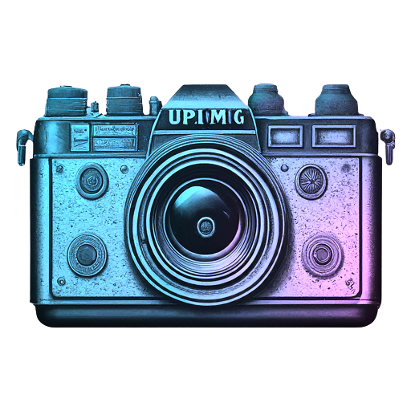

# UpImg


UpImg is a web application built with Next 14 and TypeScript that allows users to upload and manage images.

## Technologies

- Next.js
- TypeScript
- Auth0
- PocketBase
- Tailwind CSS
- ShadCn UI
- Aceternity UI

## Getting Started

To get a local copy up and running, follow these steps:

### Prerequisites

- Node.js
- npm

### Installation

1. Clone the repository:
```sh
git clone https://github.com/vaib215/upimg.git
```

2. Install NPM packages:
```sh
npm install
```

3. Create a `.env.local` file in the root of the project and add the following environment variables:
```sh
AUTH0_SECRET='YOUR_SECRET_KEY'
AUTH0_BASE_URL='http://localhost:3000'
AUTH0_ISSUER_BASE_URL='YOUR_AUTH0_DOMAIN'
AUTH0_CLIENT_ID='YOUR_CLIENT_ID'
AUTH0_CLIENT_SECRET='YOUR_CLIENT_SECRET'
POCKETBASE_URL='YOUR_POCKETBASE_URL'
```

4. Start the development server:
```sh
npm run dev
```

## Usage

Once you've started the development server, you can navigate to http://localhost:3000 in your web browser to view the application. You can upload images and manage your uploaded images.

1. Upload an image by clicking the "Upload" button and selecting an image file from your computer.
2. View your uploaded images in the "Your uploads" section.
3. Click on an image to view it in full size.
4. You can delete, download or copy the image link by clicking on the relevant buttons.

## License

Distributed under the MIT License. See `LICENSE` for more information.

## Contact

Vaibhav Kumar Singh

- [Email](mailto:sisodiya.vaib215@gmail.com)
- [LinkedIn](https://www.linkedin.com/in/vaib215/)
- [GitHub](https://github.com/vaib215)